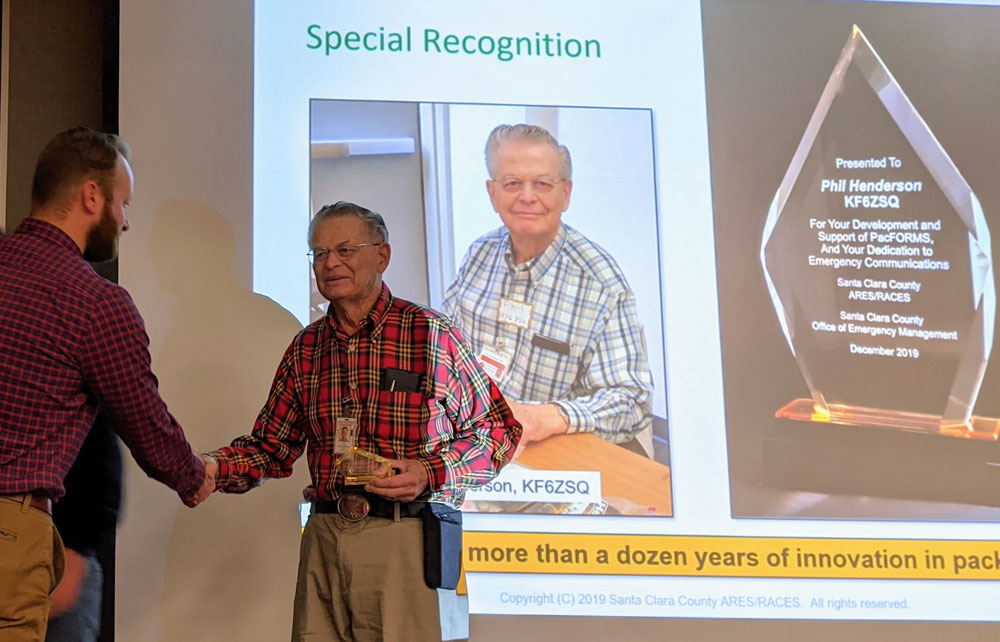

2019 has been a full year for our ARES members! Thanks to all of you, we
have been able to report to the City and County ARES/RACES that
Mountain View hams have invested over 4000 hours in city and county
training, exercises, and community events. In 2019 our members
participated in 4 Mountain View classes, 4 county exercises, 4 city events
and 2 city-wide CERT exercises, plus attending county classes. It was a
busy and productive year! This investment to both be ready to serve during
an emergency, and to generally support the community, is both rewarding to
our members and appreciated by the community.

We continue to support people becoming hams and added eight new
members this year! We also added two new AECs (Assistant Emergency
Coordinators). They are part of our core group of members who operate as
Shift Supervisors for our weekly Monday night SPECS check-ins, and our
February and August responsibilities for being net Control for the main and
UHF SPECS nets.

Probably our biggest growth has been in developing packet operations. Our
Intro to Outpost and Packet class in February was well received and it was a
great opportunity to show how it works and help those who are interested to
set up their own packet rigs.

Our support of city-wide CERT exercises in April and November
showcased our packet growth by staffing 10 of the 11 participating
neighborhood CERTs with packet stations for the November exercise. Our
goal is to have resident hams with packet capability in each active
neighborhood CERT. We had a total of 26 hams acting as radio operators during the
November drill---and that doesn't count another half dozen hams who were
wearing their CERT hats for the exercise!

We continued to support the city by acting as eyes and ears and
communication though Blackberry REACT at four City events (Spring
Parade, Art ala Carte, Art & Wine and Trailblazer). These provided an
opportunity to get the word out about Amateur Radio and demonstrate our
communication skills and support capabilities.

We also received grant funding for maintaining or upgrading equipment at
fire stations and our K6MTV radio room at 1000 Villa. We are exploring the
possibility of being included in the Association of Mountain View
Neighborhood CERTs (AMVNC) which would provide a way for donors to
give us tax-deductible contributions.

We wrapped up the year with an update to our
[Mountain View ARES Emergency Plan](resources/static/docs/mtv-emergency-plan-191124.pdf).
The key updates were the Emergency Notification Phone Tree and the
Emergency Locations sections to reflect priorities for ARES support. It's a
nice read for a "cold winter's night."

So where do we go from here? You are encouraged to check out our initial
2020 Calendar at [k6mtv.org](/) (which will be posted soon) and reserve the
dates for events that interest you. First up is the Antenna Party, Jan. 18,
10am to noon. We need net control positions filled on all Monday nights,
and our AECs and experienced hams will be happy to Elmer anyone
interested in trying it. We will also be revising our credentialing system,
adding a new "Type IV" credential. More about that later!

And finally, we are always looking for ways to involve our members, so
drop me or any of the AECs a line and tell us what you would like to do.

Leslie Grimm, EC  
Email: kk6ekn@arrl.net

## 2019 Highlights

At the May county/city communications drill ham operators in the field sent voice
messages to packet operators at the fire stations for transmission to the MTV
EOC. Phil was at Fire Station 4 and Rick and Jeff handled non-stop packet
traffic from fire stations and between the City and County EOC.

Our Mountain View Hams were in charge of the packet activity for the
County-wide communications drill in September. The exercise was held at a city
park in Campbell. We set up multiple packet stations and trained both new and
more-experienced hams.

The day after the big county-wide communications drill we came out at dawn to
support the Steven's Creek Trailblazer 5 & 10 K walk/runs in Shoreline Park.

Saturday, Dec 14th, at the county Year End Summary meeting, Phil Henderson was honored with a Special
Recognition for his development and support of PacForms over the last 12 years. Phil created the
original PacForms and improved and added to them continuously as well as supporting Emergency
Communications in the county and as an AEC and sometimes acting-EC in Mountain View.
It is a well-deserved recognition for Phil!

