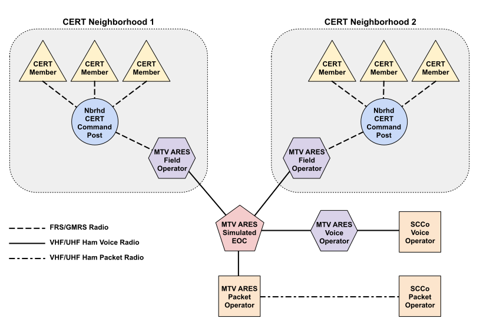

Our Mountain View hams continue to train and practice our emergency
communication skills so that we will be ready to serve the city in a time of
need. In 2020 we invested over 4000 hours in city and county trainings and
exercises despite the restrictions posed by pandemic guidelines. We increased
the number of packet-trained members and added two new people to our type IV
credentialed operators.

The year began with our annual antenna party which was well-attended by our
local members and guests from neighboring cities. We tested antennas and radios
and saw examples of go kits and other emergency radio equipment. It also was a
chance to meet each other and share experiences with emergency communication in
our cities

(Photo to left)

In February we tested packet equipment at city fire stations and identified
needs for equipment there. Rick, Phil and Paul staffed the radio room at 1000
Villa for the drill. Little did any of us realize at this time that this would
be the last time for many months that we would be able to use this room for
drills or anything else, due to restrictions for the pandemic.



With the loss of the Radio Room we had to find ways to handle communications
from our homes, following “shelter-in-place” guidelines. Our May drill “Expect
the Unexpected” was performed that way. It required more operators and outside
equipment than normal, but did give us a way to see how well we could operate
under these conditions and handle unexpected events (earthquake, loss of
repeater, loss of power, etc.)

After some trial and error we worked out a method using a remote scribe and
relay system so our members could test their personal equipment and practice net
control skills from home. During April and May’s Monday night check-ins our
members recorded how well we could hear each other and we mapped the results.




We made two maps for every participant – one showing who they could hear and one
showing who could hear them. This helps us know who could best serve from their
home as Net Control in an emergency. Special thanks to Micky and Forrest for
this work!


In August we created a drill to test ways to communicate from our homes in CERT
neighborhoods to a simulated EOC. We used a combination of FRS and ham radios
and had ham operators living near a CERT Command Post transmitting CERT
messages. While it was workable, we found it required more resources (people and
equipment) and was less effective than operating in person at the 1000 Villa
radio room and CERT command posts. We had to resort to internet or phone for
some operations that would have been handled by talking to fellow staffers if in
the radio room.

Throughout the year we have assisted CERT neighborhoods with their
communications needs. This included advice on radio equipment to purchase and
assistance with setting up equipment



We assisted CERTs in developing a new communication plan using only FRS/GMRS
channels from 1 to 14, since they were experiencing interference on higher
channels. We experimented with adjusting antenna heights so that CERTs sharing
the same channel wouldn’t interfere with each other. 

In October some of our members participated in a simulated Public Service Event
held by the county. It was called the Masked Pumpkin Festival Parade and was
held at a county park with mask and social distancing requirements. Our members
trained as check point monitors and shadows during half of the event and acted
as parade staff or members of the public during the other half.









Jeff and Kelly take the prize for the best mask! (Can you tell which is which?)


We were fortunate to receive grant funding this year from Kiwanis of Mountain
View and the Neighborhood CERT Grant Program from the city. We purchased
equipment for a mobile Command Post and a mobile packet kit for Fire Station 5.

We bought a computer and some radio equipment to complete a packet kit for the
command post. We also purchased a backup power supply and solar panel so we will
be able to operate off the grid.





We work closely with neighborhood CERTs, assisting with communication needs
especially. The umbrella group for the CERTs – Association of Mountain View
Neighborhood CERTs recently welcomed us into their organization. This will allow
us to work even more closely with CERTs, and also to participate in grant
applications, since they are a 501c3 organization.

Looking forward, we’ll be testing our new equipment and refining plans for
remote operations. When Covid restrictions loosen we hope to set up outdoors and
work with CERTs city-wide to refine our plans for emergency communications. We
appreciate the efforts of all our hams to continue trainings with the county and
check in regularly on local nets.
